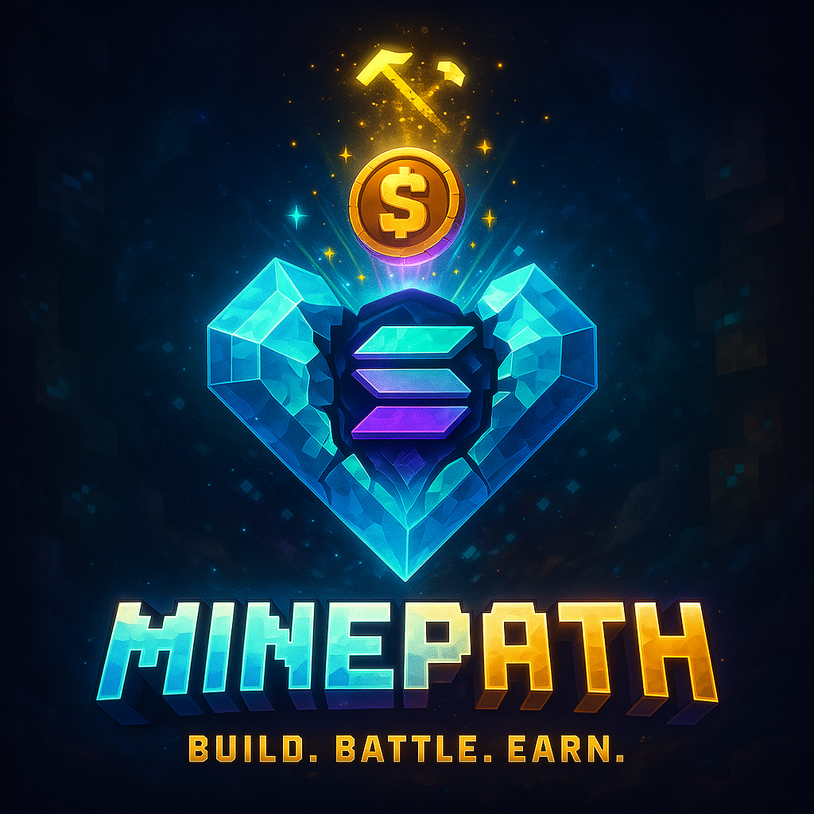
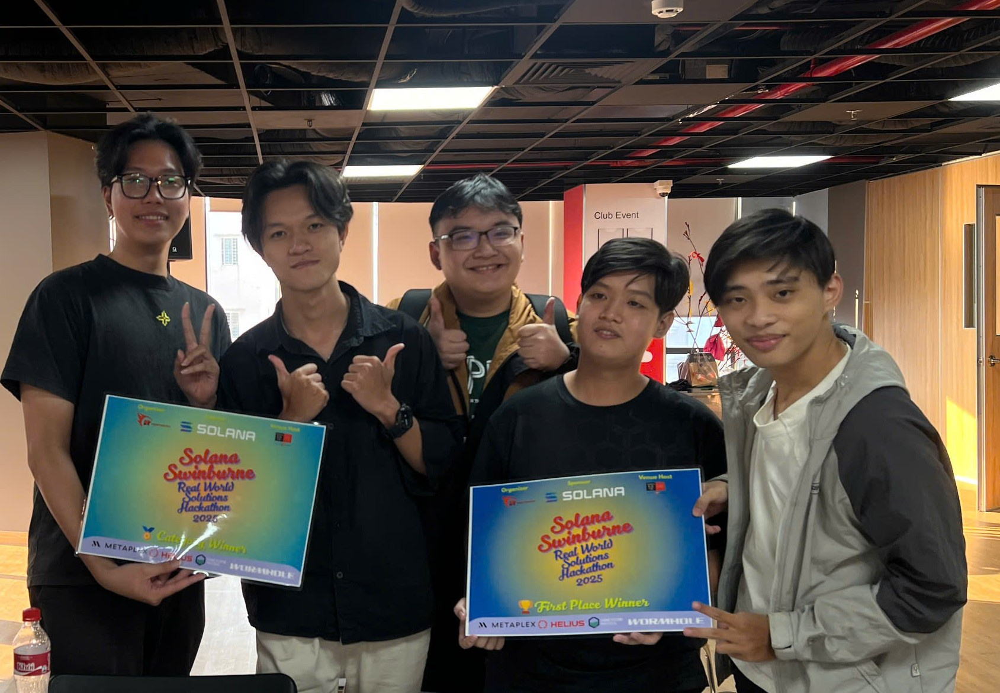

# MinePath RPG - Minecraft Server with Solana Blockchain Integration

<div align="center">
  <picture>
    <source srcset="assets/miner-banner.png" type="image/png">
    
  </picture>

  <div>
    
    
    
    
    
    
    
    
  </div>
</div>

Server Download: [MinePath_RPG.zip](https://www.mediafire.com/file/mz12iswxqxaz11g/servertien.zip/file)

Pitch Deck: [View Our Pitch Deck](https://www.canva.com/design/DAGnOR15ogA/mTiai7Dc8T14c_9BEAC6Aw/edit?ui=eyJEIjp7IlAiOnsiQiI6ZmFsc2V9fX0)

## Awards & Recognition

<div align="center">
  
  <p><strong>🏆 First Place Winner - SOLANA x SWINBURNE Real World Solutions Hackathon 2025</strong></p>
</div>

## Overview

MinePath RPG is a revolutionary Minecraft server built on [Paper](https://papermc.io/) 1.18.2 that seamlessly integrates Solana blockchain technology with traditional Minecraft gameplay. This innovative platform transforms the gaming experience by allowing players to earn real cryptocurrency tokens through in-game activities.

The server introduces a play-to-earn ecosystem where mining blocks, completing quests, and participating in the game economy rewards players with MINE tokens that can be converted to blockchain assets. Players can collect unique NFTs with special in-game abilities, upgrade their mining capabilities, and trade assets both in-game and on the Solana blockchain.

With a dual-token economy (MINE for in-game activities and PATH as the upcoming ecosystem token), MinePath RPG bridges the gap between gaming entertainment and blockchain technology, creating a sustainable digital economy where player actions have real-world value. The project aims to pioneer the future of gaming by combining the creativity and engagement of Minecraft with the financial opportunities of decentralized finance.

## Features

- **Solana Blockchain Integration**: Connect your Minecraft experience with [Solana blockchain](https://solana.com/)
- **NFT Mining System**: Mine blocks to earn tokens through the NFTMiner plugin
- **Dual Token Economy**:
  - **MINE**: In-game token earned through mining activities
  - **PATH**: Main blockchain token for the ecosystem (coming soon)
- **Token Conversion**: Export your MINE tokens to Solana blockchain wallets
- **NFT Lootboxes**: Purchase and open lootboxes to receive NFTs with special abilities
- **Wallet Authentication**: Login with your Solana wallet using the SolanaLogin plugin
- **Upgradable Mining**: Improve your mining speed and inventory capacity with tokens
- **Web Interface**: Manage your wallet connection and NFTs through a web interface
- **Custom Enchantments**: Special mining enchantments like Explosion Mining and Laser Mining

## Server Specifications

- **Minecraft Version**: [1.18.2](https://www.minecraft.net/en-us)
- **Server Software**: [Paper](https://papermc.io/downloads/paper) (paper-1.18.2-388.jar)
- **Memory Allocation**: 2GB minimum, 4GB recommended

## Complete Installation Guide

### Prerequisites

- [Java 17](https://www.oracle.com/java/technologies/javase/jdk17-archive-downloads.html) (JDK 17.0.14 or later)
- [Minecraft Java Edition 1.18.2](https://www.minecraft.net/en-us/download)
- [MySQL database](https://www.mysql.com/downloads/) (for blockchain data storage)
- [Node.js](https://nodejs.org/) (version 14 or higher, for web server components)
- [Phantom Wallet](https://phantom.app/) (browser extension or mobile app)

### Step 1: Server Setup

1. Download the server files from [MinePath_RPG.zip](https://www.mediafire.com/file/mz12iswxqxaz11g/servertien.zip/file)
2. Extract the ZIP file to your desired location
3. Edit the `start.bat` file to point to your Java installation:
   ```
   "PATH_TO_YOUR_JAVA\bin\java.exe" -Xms2G -Xmx4G -jar paper-1.18.2-388.jar nogui
   ```
4. Start the server once to generate necessary files, then stop it

### Step 2: Plugin Installation

#### NFTPlugin

1. Place `NFTPlugin.jar` in the `plugins` folder
2. Start the server to generate configuration files
3. Configure in `plugins/NFTPlugin/config.yml`:
   ```yaml
   database:
     host: localhost
     port: 3306
     database: your_database_name
     username: your_username
     password: your_password
     table-prefix: nftplugin_
   ```
4. Set up the Solana backend:
   ```bash
   cd plugins/NFTPlugin/solana-backend
   npm install
   # Configure .env file with your Solana wallet details
   ```
5. Create a `.env` file in the `plugins/NFTPlugin/solana-backend/` directory:
   ```
   SOLANA_PRIVATE_KEY=your_private_key_here
   SOLANA_NETWORK=devnet
   SOLANA_RPC_URL=https://api.devnet.solana.com
   MINT_FEE=0.000005
   CONFIRMATION_TIMEOUT=60000
   RETRY_COUNT=5
   ```

#### SolanaLogin Plugin

1. Place `SolanaLogin.jar` in the `plugins` folder
2. Start the server to generate configuration files
3. Configure in `plugins/SolanaLogin/config.yml`:
   ```yaml
   database:
     host: localhost
     port: 3306
     database: your_database_name
     username: your_username
     password: your_password
     table-prefix: walletlogin_

   web-server:
     enabled: true
     url: "http://localhost:3000"  # Change to your server's URL
     port: 3000
     qr-code-timeout: 300
     check-interval: 5
   ```
4. Set up the web server:
   ```bash
   cd plugins/SolanaLogin/web-server
   npm install
   npm start
   ```

#### Miner Simulator Plugin

1. Place `NFTMiner.jar` in the `plugins` folder
2. Start the server to generate configuration files
3. Configure in `plugins/NFTMiner/config.yml`:
   ```yaml
   # Block token values
   block-values:
     COBBLESTONE: 1
     RAW_IRON: 2
     RAW_GOLD: 5
     DIAMOND: 10
     STONE: 3
     IRON_ORE: 4
     GOLD_ORE: 10
     DIAMOND_ORE: 20

   # Database configuration
   minepath:
     host: localhost
     port: 3306
     database: your_database_name
     username: your_username
     password: your_password
   ```

#### LootBox Plugin

1. Place `LootBox.jar` in the `plugins` folder
2. Start the server to generate configuration files
3. Configure in `plugins/LootBox/config.yml`:
   ```yaml
   database:
     url: jdbc:mysql://localhost:3306/minepath
     user: your_username
     password: your_password
   ```

#### MinePath

1. Place `MinePath.jar` in the `plugins` folder
2. Start the server to generate configuration files
3. Configure in `plugins/MinePath/config.yml` as needed
4. Download web server to handle transaction at (https://github.com/HungPhan-0612/server_handle_request)
5. Open root folder of the WebServer
6. Use
      ```bash
      npm install
      npm run dev
      ```
7. At default the web will run at Port 3000

### Step 3: Web Interface Setup (Optional)

If you want to deploy the web interface for better user experience:

1. Navigate to the `Website` directory
2. Install dependencies:
   ```bash
   npm install --legacy-peer-deps
   ```
3. Build the website:
   ```bash
   npm run build
   ```
4. Deploy the built files to your web server or use a service like Vercel

### Step 4: Final Configuration

1. Make sure all plugins are properly configured
2. Ensure the web server is running and accessible
3. Update the server IP in all configuration files
4. Restart the server to apply all changes

## Plugin Details

The MinePath RPG ecosystem is powered by a suite of specialized plugins that work together to create a seamless blockchain gaming experience. Each plugin handles specific aspects of the gameplay and blockchain integration.

### NFTPlugin

The core blockchain integration plugin that connects Minecraft with the Solana ecosystem, enabling NFT functionality and management.

**Key Features:**
- **NFT Minting**: Create and distribute unique NFTs directly on the Solana blockchain
- **Advanced Inventory System**: Manage your NFT collection through an intuitive in-game interface
- **Custom Enchantments**:
  - **Explosion Mining**: Create explosive chain reactions when mining (levels I-V)
  - **Laser Mining**: Mine blocks in a straight line with laser precision (levels I-V)
- **Buff System**: Activate special "Lucky Charm" NFTs for temporary mining boosts
- **Achievement Integration**: Earn NFTs by completing special in-game achievements
- **Metadata Management**: Support for custom NFT metadata and images hosted on IPFS

**Commands:**
- `/nftinfo` - Display detailed information about NFT items and their abilities
- `/nftlist` - View all NFTs in your collection with sorting and filtering options
- `/mintnft <player> <metadata_key>` - Mint a new NFT for a player (admin only)
- `/nftbuff` - View and manage your active NFT buffs and their remaining duration

### SolanaLogin

A secure authentication system that connects player accounts with Solana blockchain wallets.

**Key Features:**
- **Blockchain Authentication**: Verify ownership through cryptographic signatures
- **Multi-Platform Support**: Connect via browser extension or mobile wallet
- **QR Code Integration**: Easily connect mobile wallets by scanning a QR code
- **Session Management**: Secure, time-limited sessions with automatic renewal
- **Hybrid Authentication**: Traditional password login with optional wallet connection
- **Web Interface**: User-friendly connection portal for wallet management

**Commands:**
- `/connectwallet` - Open the wallet connection interface
- `/connectwallet qr` - Generate a QR code for mobile wallet connection
- `/walletinfo` - Display detailed information about your connected wallet
- `/register <password> <confirmPassword>` - Create a new account
- `/login <password>` - Log in with traditional authentication
- `/disconnectwallet` - Disconnect your wallet from your Minecraft account

### NFTMiner

The mining simulation and reward system that forms the core gameplay loop.

**Key Features:**
- **Dynamic Token Rewards**: Earn MINE tokens based on block type and rarity
- **Personal Mining Areas**: Each player gets their own customizable mining dimension
- **Progressive Upgrade System**:
  - **Speed Upgrades**: Increase mining efficiency with Haste effects (5 levels)
  - **Inventory Upgrades**: Expand storage capacity for longer mining sessions (3 levels)
  - **Token Value Upgrades**: Increase the value of mined blocks (multiple levels)
- **Auto-Regenerating Mines**: Mining areas automatically replenish with new blocks
- **NFT Integration**: Special mining abilities when using NFT tools
- **Real-time Statistics**: Track your mining efficiency and earnings

**Commands:**
- `/token` - Check your current token balance and mining statistics
- `/shop` - Open the comprehensive upgrade shop interface
- `/claim` - Convert your mined blocks into MINE tokens
- `/miningbox` - Teleport to your personal mining dimension
- `/resetmine` - Regenerate your mining area with fresh blocks
- `/resetupgrades` - Reset all your upgrades (for testing or respeccing)

### LootBox

An exciting NFT distribution system based on randomized lootboxes of varying rarity.

**Key Features:**
- **Tiered Lootbox System**:
  - **Basic Lootbox** (500 MINE): Entry-level NFTs with common rewards
  - **Premium Lootbox** (1500 MINE): Mid-tier NFTs with better odds for rare items
  - **Ultimate Lootbox** (3000 MINE): High-end NFTs with the best chance for mythic items
- **Rarity System**: Five rarity tiers (Common, Rare, Epic, Legendary, Mythic)
- **Visual Unboxing Experience**: Animated lootbox opening with sound effects
- **Direct NFT Integration**: Automatically adds NFTs to your inventory
- **Drop Rate Transparency**: Clear probability information for each tier
- **Collection Tracking**: Monitor your collection progress across all NFT types

**Commands:**
- `/nftlootbox <type> <amount>` - Purchase and open NFT lootboxes
- `/nftlootbox info` - View lootbox prices and drop rates

### MinePath

The economic backbone of the ecosystem, handling the dual-token system and blockchain transactions.

**Key Features:**
- **Dual Token Economy**:
  - **MINE**: In-game utility token earned through gameplay
  - **PATH**: Ecosystem governance token (coming soon)
- **Secure Wallet Integration**: Direct connection to Solana wallets
- **Player-to-Player Trading**: Transfer tokens between players securely
- **Blockchain Export**: Convert in-game tokens to real blockchain assets
- **Transaction Verification**: Two-step verification for token exports
- **Economy Balancing**: Configurable parameters for economic stability
- **Vault Integration**: Compatible with server economy plugins

**Commands:**
- `/tokenbalance` - Check your current MINE token balance
- `/tokensend <player> <amount>` - Send MINE tokens to another player
- `/tokenclaim` - Export your MINE tokens to your connected Solana wallet
- `/tokenhelp` - Display comprehensive help information about token commands
- `/tokenauthorize` - Authorize token transactions with your wallet signature
- `/tokenbuy` - Purchase in-game items with MINE tokens
- `/tokenadmin` - Administrative commands for server operators

## Troubleshooting

This section provides solutions for common issues you might encounter when setting up and running the MinePath RPG server.

### Database Issues

#### Connection Errors
- **Symptom**: Plugins fail to start with database connection errors in logs
- **Solutions**:
  - Verify MySQL server is running (`systemctl status mysql` or check Services on Windows)
  - Confirm database credentials in all plugin config files match your MySQL setup
  - Ensure the database exists (`CREATE DATABASE minepath;` in MySQL console)
  - Check network connectivity if using a remote database
  - Verify MySQL user has proper permissions (`GRANT ALL PRIVILEGES ON minepath.* TO 'minepath'@'localhost';`)

#### Schema Issues
- **Symptom**: Plugins start but features don't work correctly
- **Solutions**:
  - Check if tables were created properly (use `SHOW TABLES;` in MySQL console)
  - Manually import schema if needed (schema files are in plugin documentation)
  - Reset plugin data if tables are corrupted (`DROP TABLE table_name;` then restart server)

### Web Server Issues

#### Connection Problems
- **Symptom**: Cannot connect to web interface or QR codes don't work
- **Solutions**:
  - Verify Node.js is installed and version is 14+ (`node -v`)
  - Ensure web server is running (`npm start` in web server directory)
  - Check correct port is being used and not blocked by firewall
  - Verify URL in plugin config matches the actual web server URL
  - Check browser console for JavaScript errors

#### Wallet Connection Failures
- **Symptom**: Cannot connect Phantom wallet to Minecraft account
- **Solutions**:
  - Ensure Phantom extension is installed and logged in
  - Check you're using the correct Solana network (devnet by default)
  - Clear browser cache and cookies
  - Try the test pages (`/test-flow.html`) to isolate the issue
  - Verify web server logs for specific error messages

### Token and NFT Issues

#### Token Balance Problems
- **Symptom**: Tokens not being credited or balances incorrect
- **Solutions**:
  - Check mining permissions in your mining area
  - Verify token values in NFTMiner config
  - Ensure database connection is stable
  - Try `/claim` command to update balances
  - Check server logs for transaction errors

#### NFT Minting Failures
- **Symptom**: Cannot mint or receive NFTs
- **Solutions**:
  - Verify Solana backend is properly configured
  - Check `.env` file has correct private key with sufficient SOL
  - Ensure metadata files exist and are properly formatted
  - Check server logs for specific Solana transaction errors
  - Verify RPC endpoint is responsive (`https://api.devnet.solana.com`)

### Plugin Compatibility

#### Version Conflicts
- **Symptom**: Plugins throwing errors or disabling at startup
- **Solutions**:
  - Ensure all plugins are compatible with Minecraft 1.18.2
  - Check for conflicting plugins that modify the same game mechanics
  - Review server logs for specific compatibility errors
  - Try disabling plugins one by one to identify conflicts

#### Performance Issues
- **Symptom**: Server lag or high resource usage
- **Solutions**:
  - Allocate more memory to the server (modify `-Xmx` in start script)
  - Optimize world settings (view distance, entity spawning)
  - Monitor CPU and memory usage during operation
  - Consider upgrading server hardware if consistently at capacity

### Advanced Troubleshooting

#### Diagnostic Commands
- `/tokenadmin debug` - Display MinePath plugin diagnostic information
- `/solanalogin status` - Check SolanaLogin plugin status
- Use server console command `timings report` to identify performance bottlenecks

#### Log Analysis
- Check `logs/latest.log` for error messages
- Enable debug logging in plugin configs for more detailed information
- Use grep or search tools to find specific error patterns

### Getting Help

For issues or questions about the server, please contact the server administrator or refer to the individual plugin documentation.

## Useful Links

- [Solana Blockchain](https://solana.com/)
- [Solana Developer Resources](https://solana.com/developers)
- [Phantom Wallet](https://phantom.app/)
- [Minecraft Wiki](https://minecraft.fandom.com/wiki/Minecraft_Wiki)
- [Paper Project](https://papermc.io/)
- [MySQL Documentation](https://dev.mysql.com/doc/)
- [Node.js Documentation](https://nodejs.org/en/docs/)

---

*Note: This server integrates with the Solana blockchain. Please ensure you understand [blockchain technology](https://solana.com/learn) and cryptocurrency before using the token export features.*

## Technologies

<div align="center">
  <!-- Backend Technologies -->
  
  
  
  

  <!-- Blockchain Technologies -->
  
  
  
  

  <!-- Web Technologies -->
  
  
  
  
  

  
</div>

